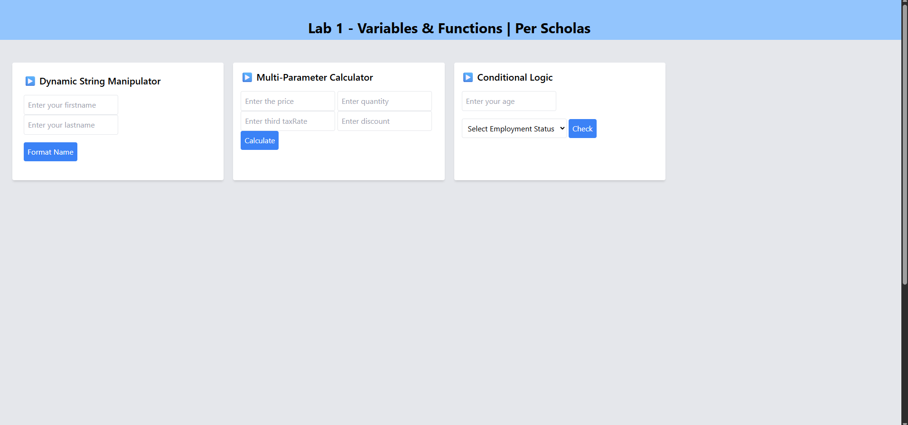

# Lab 1 - Variables & Functions | Per Scholas

## Overview
A simple interactive web page built with HTML, Tailwind CSS, and JavaScript to practice using variables, functions, and conditional logic.

### The challenge

Build a basic lab project with:

* A name formatter using string manipulation
* A multi-parameter calculator for price calculations
* A conditional logic section that determines eligibility based on age and employment status

## Screenshot

### Links

 * Live Site : [Coming Soon]

 ## My Process

 ### Built With
 * HTML
 * Tailwind CSS 
 * JavaScript(Dom,varaibles,fucntion,conditionals)

 ### What I Learned

* How to get and manipulate input from the DOM
* Basic calculation logic using multiple parameters
* How to apply conditional statements to control outcomes

### Continued Development
* Add form validation for empty or invalid inputs
* Modularize JavaScript functions for better structure
* Improve styling and mobile responsiveness

### Useful Resources
* MDN Web Docs
* Tailwind CSS Docs

### Author
* Name: Meron Teweldebrhan 
* Frontend Mentor Profile:(https://www.frontendmentor.io/profile/MeronTeweldebrhan)
* Website:https://meronpf.netlify.app/
* GitHub:https://github.com/MeronTeweldebrhan

### Acknowledgments
* Special thanks to Per Scholas for providing the guidance and platform to build this foundational project.

